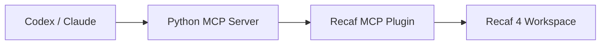

# Recaf MCP

Recaf MCP is a two-part bridge that exposes Recaf 4 reverse-engineering features as MCP tools.

- The Java plugin runs inside Recaf and serves a small localhost HTTP API.
- The Python server exposes that API as MCP tools for clients like Codex or Claude Desktop.

## Architecture



## Repository Layout

```text
.
├── src/                    # Recaf plugin source
├── mcp-server/             # Python MCP server
├── libs/                   # Put recaf.jar here locally (not committed)
├── .mcp.json               # Project MCP config for local clients
├── build.gradle.kts        # Plugin build
└── README.md
```

## Requirements

- Java 25
- Python 3.10+
- A local `recaf.jar` from Recaf 4

## Quick Start

### 1. Prepare Recaf

Place `recaf.jar` in one of these locations:

- `libs/recaf.jar`
- `../recaf/recaf.jar`
- or set `RECAF_JAR=/absolute/path/to/recaf.jar`

### 2. Build the plugin

```powershell
.\gradlew.bat jar
```

The plugin jar will be created at:

```text
build/libs/recaf-mcp-plugin-0.1.0.jar
```

### 3. Install the plugin into Recaf

Copy `build/libs/recaf-mcp-plugin-0.1.0.jar` into your Recaf plugins directory, then start Recaf.

When it loads correctly, Recaf will log:

```text
Recaf MCP plugin listening on http://127.0.0.1:8750
```

### 4. Install Python dependencies

```powershell
pip install -r mcp-server/requirements.txt
```

### 5. Start the MCP server

For stdio clients:

```powershell
python mcp-server/recaf_mcp_server.py
```

For HTTP testing:

```powershell
python mcp-server/recaf_mcp_server.py --http --port 8751
```

## MCP Client Config

This repository already includes a project-level `.mcp.json`:

```json
{
  "mcpServers": {
    "recaf": {
      "command": "python",
      "args": ["mcp-server/recaf_mcp_server.py"]
    }
  }
}
```

## Current Status

This project is usable, but still early.

- Basic class, method, decompile, inheritance, search, and file endpoints work.
- Some advanced routes are still stubs, especially parts of xrefs, refactor, export, and workspace import.

## Local Development

Useful endpoints:

- Plugin HTTP: `http://127.0.0.1:8750`
- MCP HTTP mode: `http://127.0.0.1:8751/mcp`

Health checks:

```powershell
Invoke-WebRequest http://127.0.0.1:8750/health
python mcp-server/recaf_mcp_server.py --http --port 8751
```

## Publishing Notes

- Do not commit `libs/recaf.jar`.
- Do not commit `build/`, `.gradle/`, or Python cache files.
- Pick a license before publishing publicly.

See [PUBLISHING.md](./PUBLISHING.md) for a short GitHub checklist.
