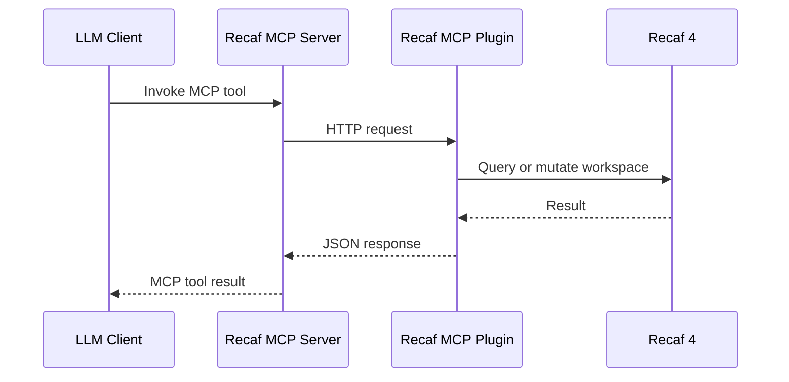

# Recaf MCP

Recaf MCP is a two-part reverse-engineering bridge for Recaf 4.

- The Java plugin runs inside Recaf and exposes a small localhost HTTP API.
- The Python MCP server turns that API into MCP tools for Codex, Claude Desktop, and similar clients.

This repository now contains both parts in one place.

## What It Is

Think of it as:

`LLM client -> MCP server -> Recaf plugin -> Recaf workspace`

The goal is the same shape as `jadx_mcp_server`, but for JVM bytecode work inside Recaf.

## Architecture



## Repository Layout

```text
.
├── src/                  # Java plugin source
├── mcp-server/           # Python MCP implementation
├── libs/                 # Local recaf.jar goes here, not committed
├── recaf_mcp_server.py   # Root launcher for the MCP server
├── requirements.txt      # Python dependencies
├── test.sh               # Basic smoke test
├── .mcp.json             # Project-local MCP config
└── README.md
```

## Current MCP Tools

### Workspace

- `get_workspace_info`
- `open_workspace`
- `close_workspace`
- `add_supporting_resource`
- `list_supporting_resources`
- `fetch_current_class`
- `get_selected_text`

### Classes

- `get_all_classes`
- `get_class_info`
- `get_class_source`
- `get_bytecode_of_class`
- `get_methods_of_class`
- `get_fields_of_class`
- `get_inner_classes`
- `get_annotations_of_class`
- `get_raw_class_bytes`

### Methods

- `get_method_by_name`
- `get_method_bytecode`
- `get_method_info`

### Search

- `search_classes_by_name`
- `search_members_by_name`
- `search_strings`
- `search_numbers`
- `search_instructions`

### Cross References

- `get_xrefs_to_class`
- `get_xrefs_to_method`
- `get_xrefs_to_field`
- `get_callers_of_method`
- `get_callees_of_method`
- `get_overrides_of_method`

### Refactor

- `rename_class`
- `rename_method`
- `rename_field`
- `rename_package`
- `rename_local_variable`
- `apply_mappings`

### Decompilers

- `list_decompilers`
- `set_active_decompiler`
- `decompile_class_with`

### Inheritance

- `get_superclasses`
- `get_interfaces`
- `get_direct_subclasses`
- `get_all_subclasses`
- `get_implementors`

### Resources And Export

- `get_all_file_names`
- `get_file_content`
- `get_manifest`
- `get_strings_from_resources`
- `export_workspace`
- `get_modified_classes`
- `revert_class`

## Current Status

This project is usable and now covers the main Recaf MCP workflow.

- The bridge is working end to end.
- Recaf loads the plugin and serves `127.0.0.1:8750`.
- The Python server starts in stdio or streamable HTTP mode.
- The Java plugin now implements workspace open/attach, xrefs, refactors, export, decompiler switching, method source lookup, bytecode search, and resource-string extraction.

It is still earlier than `jadx_mcp_server` in maturity, but the core analysis and mutation loop is in place.

## Requirements

- Java 25
- Python 3.10+
- A local `recaf.jar`

## Getting Started

### 1. Provide `recaf.jar`

The build looks for Recaf in this order:

1. `RECAF_JAR`
2. `libs/recaf.jar`
3. `../recaf/recaf.jar`

Example:

```powershell
$env:RECAF_JAR="D:\deobf\recaf\recaf.jar"
```

### 2. Build the plugin

```powershell
.\gradlew.bat jar
```

Output:

```text
build/libs/recaf-mcp-plugin-0.1.0.jar
```

### 3. Install the plugin into Recaf

Copy the built jar into your Recaf plugins directory and launch Recaf.

When it loads correctly, Recaf logs:

```text
Recaf MCP plugin listening on http://127.0.0.1:8750
```

### 4. Install Python dependencies

```powershell
pip install -r requirements.txt
```

### 5. Start the MCP server

For Codex/Desktop clients, prefer HTTP mode.
This avoids local stdio transport mismatches and matches the `jadx_mcp_server` setup.

HTTP mode:

```powershell
python recaf_mcp_server.py --http --port 8751
```

One-click PowerShell launcher:

```powershell
.\start_recaf_mcp_http.ps1
```

## MCP Client Config

This repository includes a project-local `.mcp.json` using HTTP MCP:

```json
{
  "mcpServers": {
    "recaf-mcp": {
      "url": "http://127.0.0.1:8751/mcp"
    }
  }
}
```

## Codex Notes

- To get the same tool-card style as `jadx-mcp`, Codex must load this server as an MCP server at chat startup.
- Existing chats do not hot-reload newly added MCP servers.
- If Recaf and `start_recaf_mcp_http.ps1` are already running, open a new Codex chat in this folder.
- When it is loaded correctly, tool usage appears as `Used recaf-mcp` instead of plain PowerShell commands.

## Useful Endpoints

- Plugin HTTP: `http://127.0.0.1:8750`
- MCP HTTP mode: `http://127.0.0.1:8751/mcp`

Quick health check:

```powershell
Invoke-WebRequest http://127.0.0.1:8750/health
```

## Smoke Test

```bash
./test.sh
```

That test does three things:

1. Verifies `recaf.jar` is available
2. Builds the plugin
3. Checks that the Python launcher starts

## Security Warning

If you run:

```powershell
python recaf_mcp_server.py --http --host 0.0.0.0
```

you expose the MCP server over plain HTTP with no authentication.

That means anyone on the reachable network can invoke all exposed tools.
Use localhost by default, or put it behind a firewall or tunnel.

## GitHub Publishing

This repository is ready to publish as a single project.

- `README.md` is present
- `.gitignore` is present
- `.mcp.json` is present
- root launcher and requirements are present
- a smoke-test script is present

See [PUBLISHING.md](./PUBLISHING.md) for the short checklist.
